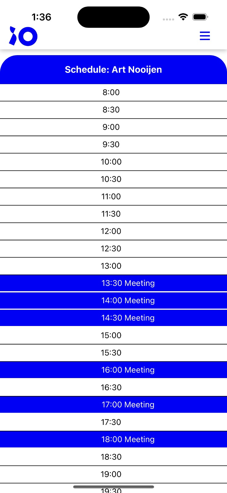

# Calendar

we created a Calendar screen that shows when users are not available so when you are looking for a meeting time you can see when everyone is available.

the data is currently hard coded using our [MockApi](https://github.com/Colleak/Backend-Colleak/blob/main/Documentation/Mock%20API%20Doc.md)

# Example Usage

```jsx
<Calendar />
```

# Code Analysis

## Inputs

lastSelectedEmployee: A string representing the name of the selected employee.
meetings: An array of boolean values indicating whether a meeting is scheduled for each hour.

## Flow

The code snippet renders a ScrollView component with a style defined in the styles object.
If lastSelectedEmployee is truthy, it renders a View component with a blue background and the name of the selected employee.
If lastSelectedEmployee is falsy, it renders a View component with a blue background and the text "Schedule: Temp".
It maps over the meetings array and renders a View component for each hour.
The style of the View component depends on the value of isMeeting in the meetings array. If isMeeting is true, it uses the activeHour style, otherwise it uses the hour style.
Inside each View component, it renders a Text component with the hour and meeting indicator.

## Outputs
A scrollable view with the selected employee's name at the top (if available) and a list of hours with meeting indicators.

